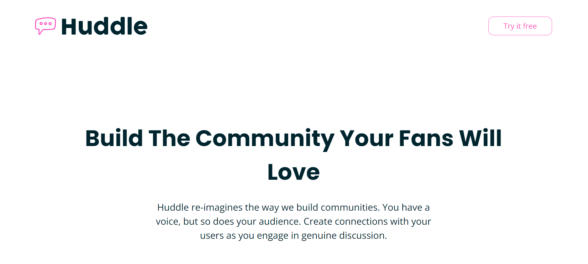

# Frontend Mentor - Huddle landing page with curved sections solution

## Table of contents

- [Overview](#overview)
  - [Screenshot](#screenshot)
  - [Links](#links)
- [My process](#my-process)
  - [Built with](#built-with)
  - [What I learned](#what-i-learned)
  - [Continued development](#continued-development)
  - [Useful resources](#useful-resources)
- [Acknowledgments](#acknowledgments)

## Overview

This is a solution to the [Huddle landing page with curved sections challenge on Frontend Mentor](https://www.frontendmentor.io/challenges/huddle-landing-page-with-curved-sections-5ca5ecd01e82137ec91a50f2).

### Screenshot

### Links

- Solution URL: [Solution URL here](https://your-solution-url.com)
- Live Site URL: [Live site URL here](https://your-live-site-url.com)

## My process

### Built with

- Semantic HTML5 markup
- CSS custom properties
- Flexbox
- CSS Grid
- Mobile-first workflow
- JavaScript

### What I learned

This was a challenging project in terms of aligning images and content of the page in a way, that would lead to the best outcome for viewers with different screen sizes. Also, this was the first time I used a little bit of JavaScript.

### Continued development

I would like to build more interactive pages using JavaScript in near future.

### Useful resources

- [Email Validation: Regex & JavaScript](https://www.abstractapi.com/guides/email-validation-regex-javascript) - This is an excellent article that breaks down the regular expressions in JavaScript email validation.
- [HTML Button onclick - JavaScript Click Event Tutorial](https://www.freecodecamp.org/news/html-button-onclick-javascript-click-event-tutorial/) - This article helped me understand two ways of executing click events in JavaScript.

## Acknowledgments

I would like to thank Bitcamp 101 (Georgia) for offering amazing lectures, and also, my mentor Paata Gharibashvili who has helped me overcome the difficulties by giving me a lot of valuable advice.
